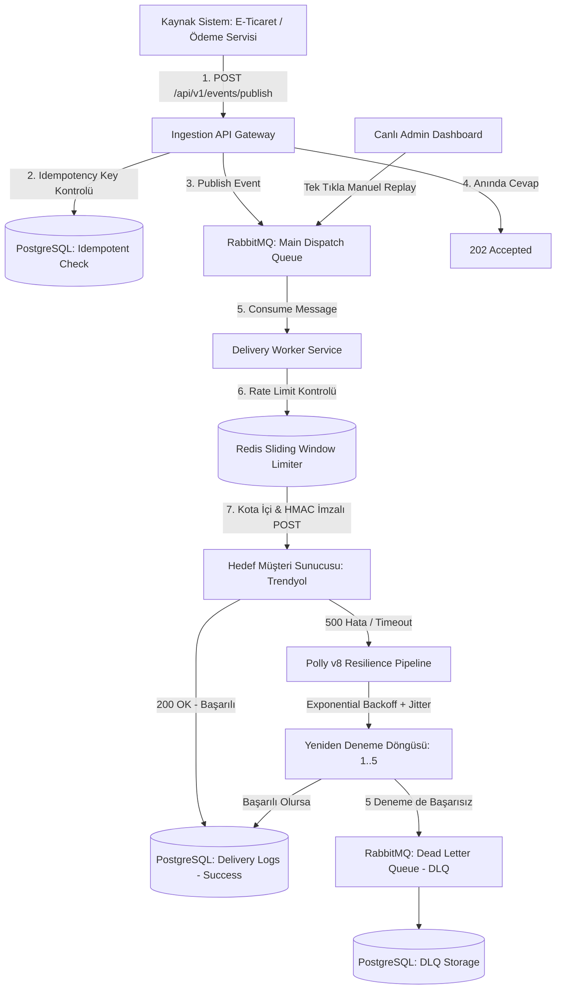

# ⚡ Resilient Webhook Platform (Enterprise Webhook Dispatcher)

[](https://dotnet.microsoft.com/)
[](https://www.postgresql.org/)
[](https://masstransit.io/)
[](https://redis.io/)
[](https://github.com/App-vNext/Polly)

> **Yüksek hacimli olay trafiğinde bildirimleri sıfır veri kaybıyla, akıllı hata yönetimiyle (Retry/Backoff) ve hedef sunucuları boğmadan (Rate Limiting) ileten kurumsal bir Webhook Dağıtım Platformudur.** (Hookdeck / Svix / Stripe Webhooks mimarisi baz alınarak geliştirilmiştir).

---

## 🏗️ 1. Mimari ve Uçtan Uca Veri Akışı



---

## 🧰 2. Teknoloji Yığını (Tech Stack)

| Katman | Teknoloji | Neden Bu Teknolojiyi Seçtik? |
|---|---|---|
| **Çözüm Mimarisi** | **Clean Architecture** | Domain, Application, Infrastructure ve API katmanlarını sıfır bağımlılıkla izole etmek için. |
| **Ana Dil & Framework** | **.NET 10 (C#)** | Yüksek performanslı asenkron I/O ve enterprise ölçeklenebilirlik. |
| **Mesaj Kuyruğu** | **RabbitMQ + MassTransit** | Asenkron olay dağıtımı, gevşek bağlılık (Loose Coupling) ve kuyruk yönetimi. |
| **Dayanıklılık (Resilience)** | **Polly v8 Core** | **Exponential Backoff**, **Random Jitter**, **Timeout (5s)** ve **Retry** politikaları. |
| **Önbellek & Rate Limit** | **Redis (StackExchange.Redis)** | Hedef sunucuları DDoS etkisinden koruyan mikrosaniye hızında **Sliding-Window Rate Limiter**. |
| **Veritabanı & ORM** | **PostgreSQL + EF Core** | Olaylar, abonelikler, teslimat tarihçesi ve indekslenmiş DLQ kayıtları. |
| **Güvenlik** | **HMAC SHA-256** | Yoldaki verinin değiştirilmediğini (Tamper-proof) garanti eden kriptografik imzalama. |
| **Konteynerizasyon** | **Docker & Docker Compose** | Postgres, Redis ve RabbitMQ'yu tek komutla izole ayağa kaldırmak için. |
| **İzleme & Test** | **Canlı Dark-Mode Dashboard** | Gerçek zamanlı metrikler, simülatör, log takibi ve tek tıkla DLQ Replay. |

---

## 💎 3. Temel Mühendislik Yetenekleri

### 🛡️ 1. HMAC SHA-256 İmza Güvenliği
Her istekte şu HTTP güvenlik başlıkları (Headers) eklenir:
* `X-Webhook-Signature`: `t=1728468586,v1=9a8b7c6d...`
* `X-Webhook-Timestamp`: `1728468586` (5 dakikalık tolerans ile **Replay Attack** engellenir).
* `X-Webhook-Id`: Benzersiz olay ID'si (**Timing Attack** koruması için `FixedTimeEquals` kullanılır).

### 🔄 2. Polly v8 Exponential Backoff + Jitter
Müşteri sunucusu kapalıysa istek hemen terk edilmez:
* **Deneme 1:** Anında
* **Deneme 2:** ~3 saniye sonra (+ Rastgele Jitter)
* **Deneme 3:** ~10 saniye sonra
* **Deneme 4:** ~30 saniye sonra
* **Deneme 5:** ~2 dakika sonra
* *Random Jitter*, 10.000 başarısız isteğin aynı milisaniyede hedefe hücum etmesini (**Thundering Herd Problem**) engeller.

### 🚦 3. Redis Sliding-Window Rate Limiter
* Müşterinin kapasitesini aşmamak için abonelik bazlı hız sınırı uygulanır (Örn: `60 req/min`).
* Limit dolduğunda mesaj silinmez; **Backpressure** uygulanarak kuyrukta bekletilir.

### 💀 4. Dead-Letter Queue (DLQ) & Manuel Replay
* 5 denemede de yanıt vermeyen mesajlar DLQ havuzuna alınır.
* Müşteri sunucusunu düzelttiğinde Dashboard üzerinden tek tıkla `POST /api/v1/dlq/{id}/replay` veya `POST /api/v1/dlq/replay-all` ile sıfırdan dağıtıma sokulabilir.

---

## 🚀 4. Hızlı Başlangıç (Quickstart)

### Adım 1: Altyapıyı Başlatın (Docker)
```bash
docker compose up -d
```
*(PostgreSQL: `5432`, Redis: `6379`, RabbitMQ UI: `http://localhost:15672`)*

### Adım 2: Veritabanını Güncelleyin
```bash
dotnet ef database update --project src/WebhookPlatform.Infrastructure --startup-project src/WebhookPlatform.Api
```

### Adım 3: Projeleri Çalıştırın
Farklı terminal pencerelerinde:

```bash
# 1. Test Alıcı Simülatörünü Başlatın (Port 5050)
dotnet run --project src/WebhookPlatform.MockReceiver

# 2. Arka Plan Dağıtım İşçisini Başlatın
dotnet run --project src/WebhookPlatform.Worker

# 3. Web API ve Canlı Dashboard'u Başlatın (Port 5000 / 5001)
dotnet run --project src/WebhookPlatform.Api
```

Tarayıcınızdan **`http://localhost:5000/dashboard`** adresini açarak canlı paneli kullanabilirsiniz!

---

## 🎯 5. Mülakat Soru & Cevap Rehberi

| Soru | Bu Projedeki Yanıtımız |
|---|---|
| **"Hedef sunucuya aynı istek 2 kere giderse ne olur?"** | Müşterinin mükerrer işlem yapmaması için her isteğe `X-Webhook-Id` ve `IdempotencyKey` eklenir (*At-Least-Once Delivery*). |
| **"10.000 webhook aynı anda çökerse sistem ne yapar?"** | **Polly v8 Exponential Backoff + Random Jitter** ile yük zamana yayılır, sunucu tekrar ayağa kalktığında ezilmez. |
| **"Müşteri sunucusu 10 saniye boyunca hiç yanıt vermezse?"** | Polly **5 saniyelik kesin Timeout** ile isteği keser ve thread'lerin kilitlenmesini önler. |
| **"Müşteri sunucusu aşırı yüklendiğinde ne yapılır?"** | **Redis Rate Limiter** ile saniyelik/dakikalık kota aşıldığında **Backpressure** uygulanır. |

---

## 📜 Lisans
Bu proje açık kaynaklıdır ve MIT lisansı ile lisanslanmıştır.
